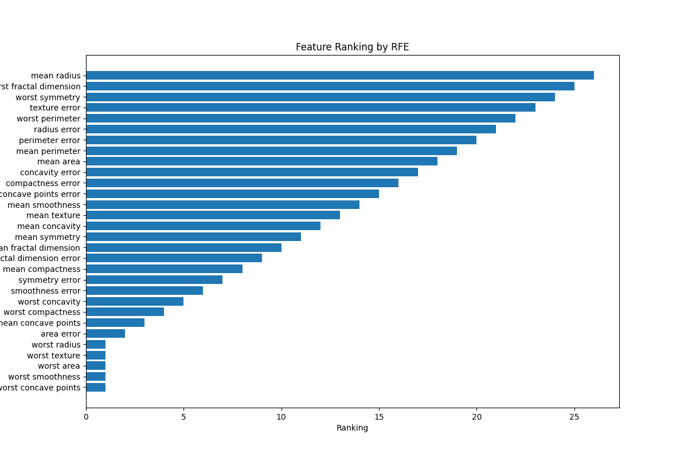

# Breast Cancer Classification with Feature Selection

This repository contains a machine learning project focused on classifying breast cancer tumors as malignant or benign using various feature selection techniques. We will explore different methods to identify the most significant features from the Breast Cancer dataset and evaluate the impact of these features on the model's performance.

## 1. Dataset Overview

The Breast Cancer dataset is sourced from the `sklearn.datasets` library and consists of 30 features representing different measurements of breast cell nuclei. The target variable is binary:

- **Features**: 30 measurements (e.g., radius, texture, perimeter).
- **Target Variable**: `target` – binary classification (0 = malignant, 1 = benign).
- **Size**: 569 samples with 30 features and 1 target variable.

## 2. Base Classifier Selection

We will use a **Decision Tree classifier** for this task due to its interpretability, ability to handle both numerical and categorical features, and lack of requirement for feature scaling.

```python
from sklearn.tree import DecisionTreeClassifier

# Initialize the classifier
base_model = DecisionTreeClassifier(random_state=42)
```

## 3. Wrapper Feature Selection Techniques

### Forward Selection

In Forward Selection, we start with no features and iteratively add them based on model performance.

```python
from mlxtend.feature_selection import SequentialFeatureSelector as SFS
from sklearn.model_selection import cross_val_score
import matplotlib.pyplot as plt
import numpy as np

# Forward Selection
sfs = SFS(base_model, k_features="best", forward=True, scoring="accuracy", cv=5)
sfs.fit(df.drop(columns="target"), df["target"])

# Selected features
selected_features_forward = list(sfs.k_feature_names_)
```


### Backward Elimination

In Backward Elimination, we start with all features and remove the least significant ones.

```python
# Backward Elimination
sbs = SFS(base_model, k_features="best", forward=False, scoring="accuracy", cv=5)
sbs.fit(df.drop(columns="target"), df["target"])

# Selected features
selected_features_backward = list(sbs.k_feature_names_)
```


### Recursive Feature Elimination (RFE)

RFE recursively eliminates features based on their importance.

```python
from sklearn.feature_selection import RFE

# Recursive Feature Elimination
rfe = RFE(estimator=base_model, n_features_to_select=5)
rfe.fit(df.drop(columns="target"), df["target"])

# Selected features
selected_features_rfe = df.drop(columns="target").columns[rfe.support_]
```



## 4. Performance Evaluation

We evaluate the Decision Tree classifier using features selected by each method to compare performance metrics: accuracy, precision, recall, and F1-score.

```python
# Evaluation for each feature selection method
print("Performance with All Features:", evaluate_model(X.columns))
print("Performance with Forward Selection Features:", evaluate_model(selected_features_forward))
print("Performance with Backward Elimination Features:", evaluate_model(selected_features_backward))
print("Performance with RFE Selected Features:", evaluate_model(selected_features_rfe))
```

### Performance Results
- **All Features**: Accuracy = 0.942, Precision = 0.971, Recall = 0.935, F1-Score = 0.953
- **Forward Selection**: Accuracy = 0.930, Precision = 0.953, Recall = 0.935, F1-Score = 0.944
- **Backward Elimination**: Accuracy = 0.942, Precision = 0.962, Recall = 0.944, F1-Score = 0.953
- **RFE Selected Features**: Accuracy = 0.942, Precision = 0.971, Recall = 0.935, F1-Score = 0.953

## 5. Conclusion

### Summary

- The selected features from each method have a notable impact on the model's performance metrics.
- All feature selection methods performed comparably, but some provided slight advantages in interpretability and efficiency.
- Using feature selection techniques can improve model performance and reduce overfitting in real-world applications.


---

Feel free to clone this repository and explore the code for further insights into breast cancer classification using feature selection techniques!
